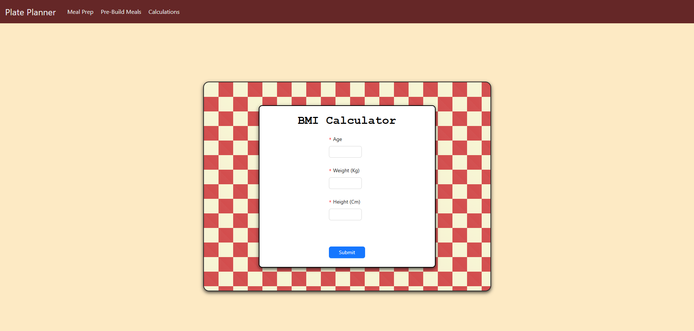

# Meal Master

**Meal Master** is a meal planning app designed to help users make informed dietary choices. Users can create custom meals or explore a library of pre-built options, each complete with detailed calorie counts.

---

## Table of Contents
- [Description](#description)
- [Features](#features)
- [Installation](#installation)
- [Usage](#usage)
- [Contributing](#contributing)
- [License](#license)
- [Acknowledgments](#acknowledgments)
- [Contact Information](#contact-information)
- [Images](#images)

---

## Description

Meal Master empowers users to take control of their nutrition by allowing them to:
- Create personalized meals with customized ingredients and portion sizes.
- Browse pre-built meals designed by nutrition experts, providing quick and balanced options for any time of day.
- Track detailed nutrition information, including calorie counts and macronutrient breakdowns, to support diverse health and fitness goals.

## Features

- **Custom Meal Creation:** Choose from a wide range of ingredients and adjust portion sizes to suit your preferences.
- **Pre-Built Meals Library:** Access a curated collection of ready-made meals with ingredient and preperation infromation.
- **Nutrition Tracking:** See calories for each meal.
- **User-Friendly Interface:** Intuitive design for easy meal planning and tracking.
- **Responsive Design:** Optimized for desktop and mobile use.

## Installation

1. Clone the repository:
   ```bash
   git clone https://github.com/Tugay72/Hotel-Management-System.git
2. Navigate to the project directory:
   ```bash
   cd Hotel-Management-System
3. Install dependencies (if applicable):
   ```bash
   npm install

## Usage
- **Creating Custom Meals:** Choose ingredients, adjust portion sizes, and see real-time calorie information.
- **Browsing Pre-Built Meals:** Find ready-to-go meal options complete with calorie breakdowns.
- **Tracking Nutrition:** Access an easy-to-read breakdown of calories for each meal to align with fitness or dietary goals.


## Contributing
1. Fork the repository.
2. Create a new branch for your feature or bugfix:
   ```bash
   git checkout -b feature-branch
3. Commit your changes:
   ```bash
   git commit -m "Add some feature"
4. Push to the branch:
   ```bash
   git push origin feature-branch

5.Create a new Pull Request.

## License
This project is licensed under the Creative Commons Attribution-NonCommercial 4.0 International License) - see the LICENSE file for details.


## Acknowledgments
Ant Design for UI components.
**DataSets:** 
- Pre-Builds Page: https://www.kaggle.com/datasets/pes12017000148/food-ingredients-and-recipe-dataset-with-images
- Meal-Prep Page: https://www.kaggle.com/datasets/kkhandekar/calories-in-food-items-per-100-grams/data

## Contact Information
Project Link: https://github.com/Tugay72/Plate-Planner

## Images


 


 


 


 

## Notes:
- **Adjustments:** Modify the installation and usage instructions based on the actual setup for your project, especially if you're using a specific framework or technology stack.
- **Licensing and Acknowledgments:** Creative Commons NonCommercial (CC BY-NC)
- **Data**: The actively used data on the Pre-Builds page is 10% of the total data and is local.

Feel free to let me know if you need any more modifications or additions!
